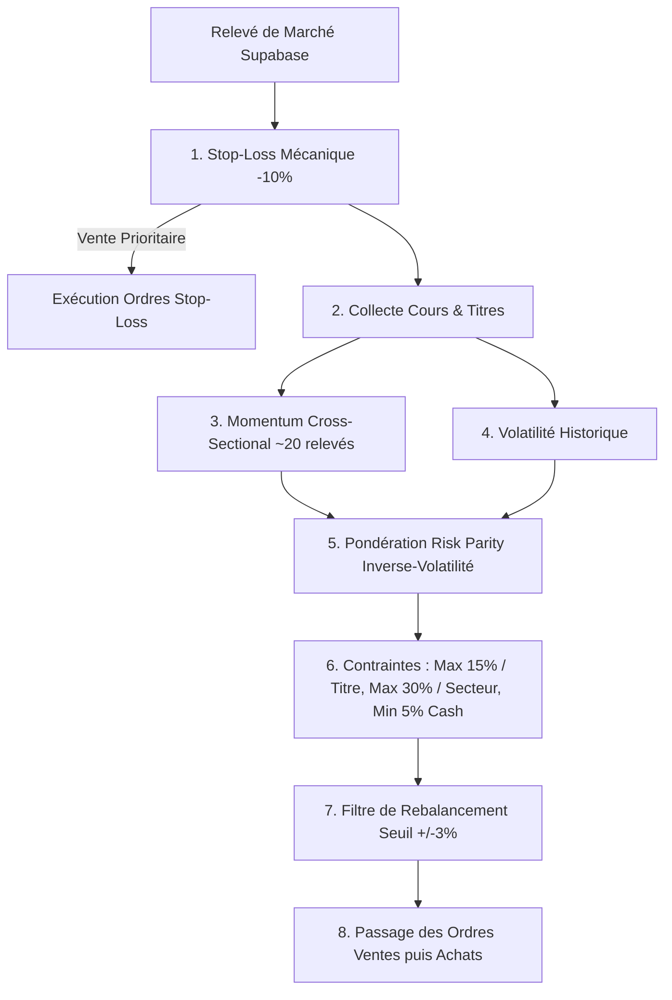

# 📈 Bot de Gestion Parquet CAC 40

> **Projet de trading algorithmique systématique & gestion de portefeuille pour la simulation boursière Parquet CAC 40.**  
> Capital initial : **1 000 000 €** | Durée du concours : **2 mois** | Objectif : **Maximisation de la performance ajustée du risque**.

---

## 1. 🎯 Contexte & Cadre Réglementaire

Ce projet implémente un robot de gestion de portefeuille automatisé tournant 24h/24 et 7j/7 sur la plateforme [Parquet CAC 40](https://parquet-cac40.netlify.app).
L'usage d'un script automatisé exploitant la cadence des relevés a été **explicitement autorisé** par l'enseignant encadrant la compétition.

---

## 2. 🏛️ Architecture Technique du Marché

Le backend du marché repose sur une instance Supabase (`https://tsztojpbwiwlluheoyos.supabase.co`).

### Tables & Vues Supabase
| Objet | Type | Description / Rôle |
|---|---|---|
| `titres` | Table | Univers d'investissement des valeurs du CAC 40 (`symbole`, `libelle`, `secteur`, `actif`, `est_indice`). |
| `cours` | Table | Historique des cours par horodatage (`horodatage`, `symbole`, `valeur`). |
| `ordres` | Table | Registre des ordres (`etudiant_id`, `sens`, `symbole`, `quantite`, `statut`, `saisi_le`, `frais`). |
| `v_portefeuille`| Vue RLS | Synthèse du portefeuille de l'étudiant (`solde`, `valeur_totale`). |
| `v_positions` | Vue RLS | Détail des positions ouvertes (`symbole`, `quantite`, `pru`, `dernier_cours`, `plus_value_pct`). |

### Procédures Distantes (RPC Supabase)
- `passer_mon_ordre(p_sens, p_symbole, p_quantite)` : Point d'entrée unique pour transmettre un ordre d'achat ou de vente.
- `mon_etudiant()` : Identifiant unique de l'étudiant connecté (sécurité RLS).
- `mes_ordres_en_attente()` : Liste des ordres en attente d'exécution au prochain relevé.
- `prochain_releve()` / `prochaine_mise_a_jour()` : Horodatage du prochain cycle de marché.
- `mon_rang()` : Position en temps réel dans le classement de la promotion.

### ⏱️ Mécanisme de Prix & Anti-Arbitrage de Latence
- **10 relevés fixes par jour** : 9h00, 10h00, 11h00, 12h00, 13h00, 14h00, 15h00, 16h00, 17h00, 17h30.
- Les cours proviennent de Yahoo Finance avec ~15 à 20 min de délai de publication.
- **Règle d'exécution** : Un ordre s'exécute toujours au premier relevé dont l'horodatage est **strictement postérieur** à la saisie de l'ordre. Il est donc impossible d'exploiter un arbitrage de latence sur le passé. La création de valeur repose entièrement sur la **sélection factorielle quantitative** et le **risk management**.

---

## 3. 🧠 Stratégie Quantitative

L'algorithme implémente une gestion factorielle systématique rigoureuse :



1. **Momentum Cross-Sectional** : Surpondération des titres affichant les meilleurs rendements relatifs sur les 20 derniers relevés (~2 jours de cotation).
2. **Inverse-Volatilité (Risk Parity)** : À conviction égale, les titres plus stables obtiennent un poids plus élevé afin d'égaliser la contribution au risque.
3. **Plafonds de diversification stricts** :
   - Maximum **15%** de la valeur totale du portefeuille par action.
   - Maximum **30%** par secteur économique GICS.
4. **Coussin de liquidité permanent** : Au moins **5%** du portefeuille conservé en cash pour absorber la volatilité.
5. **Stop-Loss mécanique** : Déclenchement automatique d'un ordre de vente dès qu'une position subit **-10%** de perte par rapport à son PRU (Prix de Revient Unitaire).
6. **Filtre anti-frais de transaction** : Aucun rééquilibrage n'est déclenché si l'écart d'allocation cible est inférieur à **3 points de pourcentage** (`REBALANCE_THRESHOLD = 0.03`).

---

## 4. 🚀 Installation & Démarrage Rapide

### Prérequis
- Python 3.9+ ou Docker
- Git

### 1. Cloner et configurer l'environnement
```bash
git clone <URL_DU_REPO>
cd parquet-cac40-bot

# Création de l'environnement virtuel
python3 -m venv .venv
source .venv/bin/activate  # Sur Windows: .venv\Scripts\activate

# Installation des dépendances
pip install -r requirements.txt
```

### 2. Configurer les variables d'environnement
Copiez le modèle et renseignez vos identifiants :
```bash
cp .env.example .env
```

Dans `.env` :
```env
SUPABASE_URL=https://tsztojpbwiwlluheoyos.supabase.co
SUPABASE_KEY=sb_publishable_UoPH4BSZJkSd9f_YBxzPpg_2ZopR2OA

ETUDIANT_EMAIL=votre_email_etudiant@domaine.fr
ETUDIANT_PASSWORD=votre_mot_de_passe

# Laissez à true pour simuler sans envoyer d'ordres réels
DRY_RUN=true
```

### 3. Exécuter le bot
```bash
# Mode simulation (DRY_RUN=true) ou réel (DRY_RUN=false dans .env)
python parquet_bot.py
```

---

## 5. 🌐 Options de Déploiement Permanent 24/7

### Option A : Docker / Docker Compose (Recommandé sur VPS)
```bash
docker compose up -d --build
docker compose logs -f
```

### Option B : GitHub Actions (Sans serveur requis)
Le workflow [`.github/workflows/market_cycle.yml`](.github/workflows/market_cycle.yml) est déjà configuré pour déclencher un cycle 20 minutes après chaque relevé officiel du CAC 40 du lundi au vendredi.

Ajoutez simplement vos secrets dans **Settings > Secrets and variables > Actions** sur GitHub :
- `SUPABASE_URL`
- `SUPABASE_KEY`
- `ETUDIANT_EMAIL`
- `ETUDIANT_PASSWORD`
- `DRY_RUN` (`false` pour trader en réel)

### Option C : Hébergement Cloud Worker (Render / Railway / Fly.io)
Déployez le dépôt comme un **Background Worker** en renseignant les variables d'environnement depuis le dashboard du fournisseur.

---

## 6. 🔒 Sécurité & Bonnes Pratiques

- **Le fichier `.env` et les fichiers `.log` sont strictement ignorés par Git via `.gitignore`.**
- Ne committez jamais vos identifiants ou mots de passe sur GitHub.
- Vérifiez toujours le comportement du bot en mode `DRY_RUN=true` sur au moins 2 ou 3 relevés de marché avant de basculer `DRY_RUN=false`.
